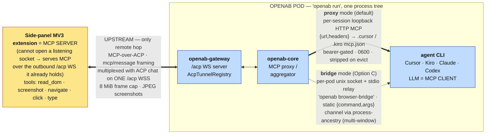
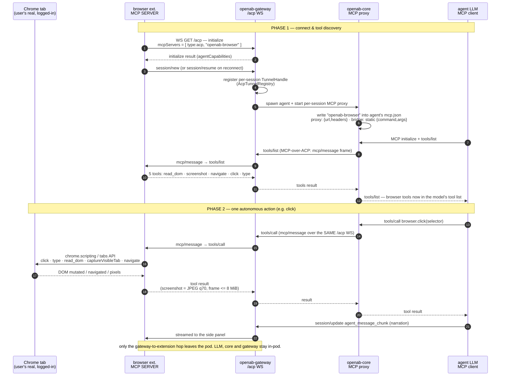

# ADR: Reverse MCP-over-ACP over WebSocket

- **Status:** Accepted — the mechanism is **as-built in #1447**; the generic multi-server
  generalization (§6) is accepted and implementing in the same PR.
- **Date:** 2026-07-18 (updated 2026-07-24)
- **Author:** @brettchien
- **Related:** [ACP Server over WebSocket — Base (as-built)](./acp-server-websocket-base.md),
  [ACP Server with WebSocket Transport](./acp-server-websocket.md) (original proposal),
  [openab-agent MCP](./openab-agent-mcp.md).
  **Browser-specific design + the contract the extension implements:**
  [Browser control via MCP-over-ACP](./acp-server-websocket-mcp-browser.md).

---

## 1. Context

This ADR records **reverse MCP-over-ACP**: a mechanism that lets an ACP **WebSocket client** —
one that cannot open a listening socket — nevertheless act as an **MCP server**, serving its
tools to a colocated agent over the outbound `/acp` WS it already holds. OpenAB core is the MCP
proxy/aggregator in the middle; the agent is a normal in-pod MCP client.

The first, driving consumer is **browser control**: a browser side-panel extension serves DOM
tools so the agent's LLM can autonomously operate the user's real, logged-in Chrome (see the
[browser ADR](./acp-server-websocket-mcp-browser.md) for that concrete design and the extension
contract). This ADR describes the general mechanism and its generalization to **multiple,
arbitrary** client-side MCP servers (§6), using browser control as the running example.

## 2. Decision

Expose a client-side capability as **MCP tools** and route them to the agent via **MCP-over-ACP**,
tunnelled over the **existing `/acp` WebSocket** the client already holds.

Why MCP (not a custom ACP `ExtRequest`): for the LLM to *autonomously* use a capability, its
actions must appear in the agent's tool list (`tools/list`) so the model discovers and calls them.
A custom `ExtRequest` is a transport-level ACP extension the LLM never sees as a tool — it only
fits OpenAB-driven (non-LLM) operations. MCP is the standard way agents receive tools.

### Roles
- **ACP WS client = MCP server (role/logic).** It handles `tools/list` / `tools/call` and executes
  the actions. A client that cannot open a *listening* socket (e.g. an MV3 browser extension) can
  still be an MCP server — MCP server/client is about *who provides tools*, not who opens the
  connection — so it serves MCP over the **outbound `/acp` WS it already opened**. This is the only
  way a can't-listen client can be a full MCP server.
- **OpenAB core = MCP proxy/aggregator.** A middlebox between two connections: it consumes the
  client's tools from the upstream tunnel and re-exposes them to the agent downstream so the LLM's
  `tools/list` sees them.
- **Agent = MCP client.** The agent (Claude / Codex / Cursor / Kiro …) is a subprocess colocated in
  the OpenAB pod; it calls the tools over its in-pod MCP link.

### One WebSocket, multiplexed
The single `/acp` WS carries BOTH the ACP chat session (initialize / session.prompt /
session.update) AND the tunnelled MCP traffic (tools/list / tools/call / results), distinguished by
ACP method namespace. No second connection. This multiplexing applies to the **upstream** hop
(client ↔ gateway), using the official MCP-over-ACP `mcp/message` framing. The **downstream** hop
(core ↔ agent) is *not* tunnelled over ACP — core hosts a normal in-process MCP server the agent
connects to; only the client, which cannot listen, needs MCP tunnelled over its `/acp` WS.

## 3. Protocol gap to close first

The base does only client→agent (prompt) and agent→client **notifications** (streaming text).
Reverse MCP needs the **agent→client REQUEST** direction (request/response: the agent asks the
client to do X and awaits a result). The WS is already bidirectional; `acp_server`'s dispatch loop
adds the agent-initiated-request path. This is also where the wire types move from hand-rolled to
**generated** (see §8).

## 4. Architecture (browser control as the example)

Only the client (extension) is remote; core, gateway and agent are one in-pod `openab run` process
tree. The downstream hop has two delivery modes (§ browser ADR / §6.3): `proxy` (HTTP MCP, default)
and `bridge` (stdio relay).

## 5. MCP usage sequence (browser.click as the example)

The exact two-id-space bookkeeping (outer ACP-envelope id ↔ inner MCP id, flattened per the RFD) is
detailed in the [browser ADR](./acp-server-websocket-mcp-browser.md) §4.

## 6. Generalization — multiple client-side MCP servers

The browser path wires **one** MCP server. This section is the accepted direction (implementing in
#1447) to make reverse MCP-over-ACP **generic**: any ACP WS client may declare **one or more**
`type:acp` MCP servers on `initialize`, and the agent's LLM discovers and calls each server's real
tools. The browser extension becomes *one instance* of the mechanism, not a special case.

Three pieces already generalize and are reused as-is:
- `parse_acp_mcp_servers` already parses **N** `type:acp` entries with arbitrary `{id, name}`.
- `establish_and_register_tunnel(…, srv.id, …)` already threads the declared `srv.id` into
  `mcp/connect` — the wire already carries a per-server discriminator.
- `ProxyHandler::forward_tool_call` forwards **any** tool name+args down the tunnel — no
  browser-specific validation.

### 6.1 Address every hop by `(channel_id, serverId)`
- `AcpTunnelRegistry` becomes keyed by `(channel_id, serverId)` instead of `channel_id` alone — the
  "one tunnel per session" collapse was a fan-out fix; the correct fix is a **compound key**.
- Rename the core trait `BrowserTunnel` → **`AcpMcpTunnel`**; `call(channel_id, server_id, method, params)`.
- Evict all `(channel_id, *)` entries on session teardown.

### 6.2 Dynamic tool discovery (supersedes static-advertise as the default)
- Each per-server proxy's `tools/list` forwards the client server's **real** tool list over its tunnel.
- **Unattached / reconnecting:** return an empty list for that server — never fabricate tools.
- **Attach → refresh:** on tunnel attach (or client re-declare on `session/resume`), push
  `notifications/tools/list_changed` downstream so the agent re-lists. This preserves the
  "usable before/without attach" UX that the browser's static-advertise (D4) gave, honestly.
- Keep a per-server **cache** of the last good `tools/list` to survive brief reconnects; **debounce**
  `list_changed` against reconnect storms.
- The browser's static-advertise stays only as an **opt-in** fallback for the browser case; it is no
  longer the default.

### 6.3 Per-server downstream exposure (Option B — decided)
Each declared client server is surfaced to the agent as its **own** MCP server entry (`openab-<name>`),
not merged into one namespaced blob:
- **proxy mode (HTTP):** one loopback MCP server per `(session, server)`, its own port + bearer;
  openab writes **N entries** into the agent's native MCP config, one per server.
- **bridge mode (stdio):** the static entry gains a selector —
  `{"command":"openab","args":["mcp-bridge","--server","<id>"]}` — one relay per server (rename the
  `browser-bridge` subcommand to `mcp-bridge`, keeping `browser-bridge` as a compat alias).

Rejected — **Option A** (one aggregating proxy, `<server>__<tool>` namespacing): the prefix leaks into
the tool names the model sees and needs reversible de-namespacing on every call. Option B is cleaner
for the LLM and maps to MCP's native "one server = one connection" model. (A stays a possible future mode.)

### 6.4 Backward compatibility
The browser extension is unchanged: it declares `{type:acp, id, name:"openab-browser"}` and serves its
five DOM tools via its own `tools/list` — now discovered dynamically instead of static-advertised. Both
downstream modes are retained; single-server (browser-only) sessions behave identically.

### 6.5 Generic implementation plan (folded into #1447)
- **P1** compound-key registry + `serverId` on the tunnel trait (no behaviour change; browser stays single).
- **P2** dynamic `tools/list` forwarding + per-server cache + `list_changed` attach/detach lifecycle.
- **P3** per-server downstream exposure (Option B) in both proxy + bridge modes; loop config-writing.
- **P4** generalize naming (`AcpMcpTunnel`, `openab-<name>`, `openab mcp-bridge`) + error strings.
- **P5** e2e: a second, non-browser `type:acp` MCP server declared alongside the browser — both
  discovered and callable in one session.

## 7. Alternatives considered

- **Custom `ExtRequest` per action** — rejected: not surfaced to the LLM as a tool, so the model
  can't call it autonomously. Fits OpenAB-driven ops only.
- **Client hosts a standalone MCP server (HTTP/SSE)** — rejected for can't-listen clients: an MV3
  extension cannot open a listening socket.
- **On-stream MCP-over-ACP for the downstream hop** — rejected: agents already connect to normal MCP
  servers well; a special on-stream MCP type is invasive
  ([ACP discussion #58](https://github.com/orgs/agentclientprotocol/discussions/58)). Only the
  can't-listen *client* leg is tunnelled; downstream stays a normal in-process MCP server.
- **Static-advertise as the default** — superseded by §6.2 (dynamic + `list_changed`); kept as an
  opt-in for browser only.

## 8. Typing / dependencies

- Bidirectional tool-call / client-method messages are where hand-rolling breaks; the expanded
  surface uses **generated** serde-only **v1** wire types (offline `typify` codegen, avoiding the
  `schemars`-heavy `agent-client-protocol-schema` crate). Landed in the base.
- The MCP machinery (handshake, tool lifecycle, tunnel framing) needs an MCP implementation
  (`rmcp`, already used by `openab-agent`) plus the ACP-tunnel transport glue.

## 9. Relationship to Computer Use

Same category as "computer use" (LLM autonomously drives an app via a perceive→act tool loop), but
generalized: (a) targets the **user's real** app/session (e.g. logged-in Chrome), not a sandbox; (b)
the action surface is **client-defined MCP tools** (DOM-semantic or screenshot), not a model-specific
tool; (c) **model-agnostic** — any MCP-capable agent can use it.

## 10. References

- [Base ADR](./acp-server-websocket-base.md) · [Original proposal](./acp-server-websocket.md) ·
  [openab-agent MCP](./openab-agent-mcp.md)
- **Browser-specific design + extension contract:**
  [Browser control via MCP-over-ACP](./acp-server-websocket-mcp-browser.md)
- [MCP-over-ACP tunnel contract](../mcp-over-acp-tunnel-contract.md) ·
  [Browser MCP agent setup](../browser-mcp-agent-setup.md)
- [MCP-over-ACP RFD](https://agentclientprotocol.com/rfds/mcp-over-acp) · MCP
  `notifications/tools/list_changed`
