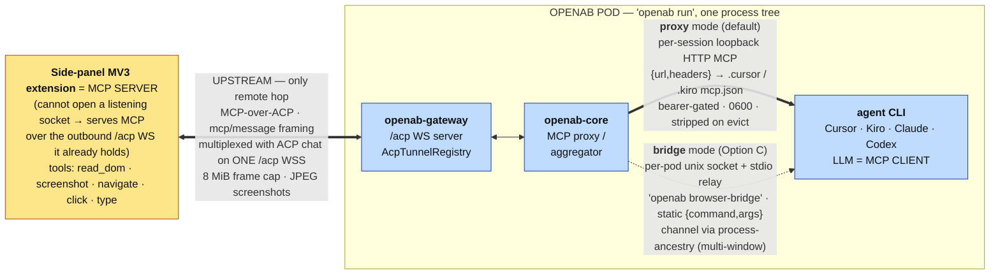
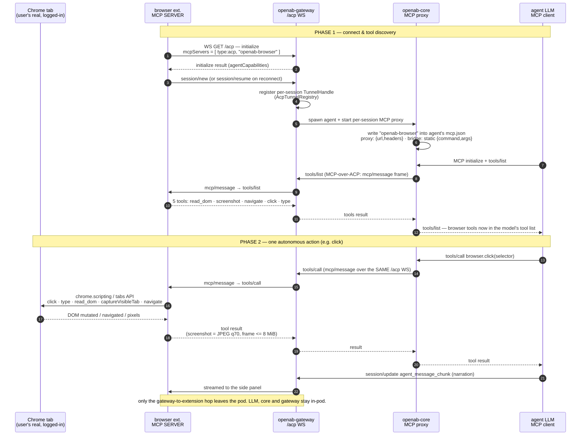

# ADR: Reverse MCP-over-ACP over WebSocket

- **Status:** Accepted — the mechanism is **as-built in #1447**; the generic multi-server
  generalization (§6) is accepted and implementing in the same PR.
- **Date:** 2026-07-18 (updated 2026-07-24)
- **Author:** @brettchien
- **Related:** [ACP Server over WebSocket — Base (as-built)](./acp-server-websocket-base.md),
  [ACP Server with WebSocket Transport](./acp-server-websocket.md) (original proposal),
  [openab-agent MCP](./openab-agent-mcp.md).
  **Browser-specific design + the contract the extension implements:**
  [Browser control via MCP-over-ACP](./acp-server-websocket-mcp-browser.md).

---

## 1. Context

This ADR records **reverse MCP-over-ACP**: a mechanism that lets an ACP **WebSocket client** —
one that cannot open a listening socket — nevertheless act as an **MCP server**, serving its
tools to a colocated agent over the outbound `/acp` WS it already holds. OpenAB core is the MCP
proxy/aggregator in the middle; the agent is a normal in-pod MCP client.

The first, driving consumer is **browser control**: a browser side-panel extension serves DOM
tools so the agent's LLM can autonomously operate the user's real, logged-in Chrome (see the
[browser ADR](./acp-server-websocket-mcp-browser.md) for that concrete design and the extension
contract). This ADR describes the general mechanism and its generalization to **multiple,
arbitrary** client-side MCP servers (§6), using browser control as the running example.

## 2. Decision

Expose a client-side capability as **MCP tools** and route them to the agent via **MCP-over-ACP**,
tunnelled over the **existing `/acp` WebSocket** the client already holds.

Why MCP (not a custom ACP `ExtRequest`): for the LLM to *autonomously* use a capability, its
actions must appear in the agent's tool list (`tools/list`) so the model discovers and calls them.
A custom `ExtRequest` is a transport-level ACP extension the LLM never sees as a tool — it only
fits OpenAB-driven (non-LLM) operations. MCP is the standard way agents receive tools.

### Roles
- **ACP WS client = MCP server (role/logic).** It handles `tools/list` / `tools/call` and executes
  the actions. A client that cannot open a *listening* socket (e.g. an MV3 browser extension) can
  still be an MCP server — MCP server/client is about *who provides tools*, not who opens the
  connection — so it serves MCP over the **outbound `/acp` WS it already opened**. This is the only
  way a can't-listen client can be a full MCP server.
- **OpenAB core = MCP proxy/aggregator.** A middlebox between two connections: it consumes the
  client's tools from the upstream tunnel and re-exposes them to the agent downstream so the LLM's
  `tools/list` sees them.
- **Agent = MCP client.** The agent (Claude / Codex / Cursor / Kiro …) is a subprocess colocated in
  the OpenAB pod; it calls the tools over its in-pod MCP link.

### One WebSocket, multiplexed
The single `/acp` WS carries BOTH the ACP chat session (initialize / session.prompt /
session.update) AND the tunnelled MCP traffic (tools/list / tools/call / results), distinguished by
ACP method namespace. No second connection. This multiplexing applies to the **upstream** hop
(client ↔ gateway), using the official MCP-over-ACP `mcp/message` framing. The **downstream** hop
(core ↔ agent) is *not* tunnelled over ACP — core hosts a normal in-process MCP server the agent
connects to; only the client, which cannot listen, needs MCP tunnelled over its `/acp` WS.

## 3. Protocol gap to close first

The base does only client→agent (prompt) and agent→client **notifications** (streaming text).
Reverse MCP needs the **agent→client REQUEST** direction (request/response: the agent asks the
client to do X and awaits a result). The WS is already bidirectional; `acp_server`'s dispatch loop
adds the agent-initiated-request path. This is also where the wire types move from hand-rolled to
**generated** (see §8).

## 4. Architecture (browser control as the example)



Only the client (extension) is remote; core, gateway and agent are one in-pod `openab run` process
tree. The downstream hop has two delivery modes (§ browser ADR / §6.3): `proxy` (HTTP MCP, default)
and `bridge` (stdio relay).

## 5. MCP usage sequence (browser.click as the example)



The exact two-id-space bookkeeping (outer ACP-envelope id ↔ inner MCP id, flattened per the RFD) is
detailed in the [browser ADR](./acp-server-websocket-mcp-browser.md) §4.

## 6. Generalization — multiple client-side MCP servers

The browser path wires **one** MCP server. This section is the accepted direction (implementing in
#1447) to make reverse MCP-over-ACP **generic**: any ACP WS client may declare **one or more**
`type:acp` MCP servers on `initialize`, and the agent's LLM discovers and calls each server's real
tools. The browser extension becomes *one instance* of the mechanism, not a special case.

Three pieces already generalize and are reused as-is:
- `parse_acp_mcp_servers` already parses **N** `type:acp` entries with arbitrary `{id, name}`.
- `establish_and_register_tunnel(…, srv.id, …)` already threads the declared `srv.id` into
  `mcp/connect` — the wire already carries a per-server discriminator.
- `ProxyHandler::forward_tool_call` forwards **any** tool name+args down the tunnel — no
  browser-specific validation.

### 6.1 Address every hop by `(channel_id, serverId)`
- `AcpTunnelRegistry` becomes keyed by `(channel_id, serverId)` instead of `channel_id` alone — the
  "one tunnel per session" collapse was a fan-out fix; the correct fix is a **compound key**.
- Rename the core trait `BrowserTunnel` → **`AcpMcpTunnel`**; `call(channel_id, server_id, method, params)`.
- Evict all `(channel_id, *)` entries on session teardown.

**`id` and `name` are different things, and routing needs both.** A declaration is
`{type:"acp", id, name}`, and the two fields have very different lifetimes — the reference client mints
`id` as a fresh `crypto.randomUUID()` **per connection** while `name` (`"browser"`) is stable across
reconnects. The registry key is the **`id`**; the `<server>` segment of a tool name (`browser.click`)
and the §6.4 allowlist are the **`name`**. Consequences, all confirmed by review 2026-07-26:

- The registry stays keyed by `(channel_id, id)` — keying by `name` would let two same-name tunnels
  overwrite each other, reintroducing exactly the fan-out collapse this section fixes — but it must
  **also record the declared `name`**, so a source can enumerate `(name, id)` for a channel and resolve
  a tool prefix to a tunnel. Routing purely on the registry key cannot work: the key is a UUID the tool
  name never contains.
- Trust gating (§6.4) is keyed by **`name`**. An allowlist of `id`s is meaningless when they are
  per-connection UUIDs.
- **Same-name collisions resolve last-attach-wins (LWW):** a newly attached tunnel whose `name` matches
  an existing one on the same channel **replaces and evicts** the older entry. Because the client mints
  a new `id` on every reconnect, the stale entry would otherwise linger beside the live one; answering
  "ambiguous, disambiguate by server_id" there would wedge the client out of its own tools on every
  reconnect. LWW keeps reconnect self-healing; the eviction is what stops unbounded growth.

### 6.2 Downstream exposure — one `CapabilitySource` behind the OAB MCP Facade

> **Revised 2026-07-26.** An earlier draft of §6.2–§6.5 proposed a bespoke path: per-`(session, server)`
> loopback MCP proxies, openab writing N entries into the agent's MCP config, dynamic `tools/list` with
> `notifications/tools/list_changed`. That is **superseded**. The
> [OAB MCP Facade](../oab-mcp-facade.md) ([OAB MCP Adapter ADR](./oab-mcp-adapter.md), #1446; facade
> #1448/#1453) and its **session-aware in-process capability sources** (#1454) already provide the
> multi-provider catalog, discovery, policy runtime (schema validation, timeouts, circuit breaking,
> redaction, audit) and lifecycle this section was about to reinvent. Reverse-MCP-over-ACP contributes
> the one thing the facade lacks: a **transport for providers that cannot listen and are dialled in by
> the client**. As of 2026-07-26 the whole facade series is merged upstream (#1446/#1448/#1449/#1450/
> #1453/#1454) and no facade PR remains open, so this section builds on a settled foundation.
>
> The adapter ADR reaches the same conclusion from the other side: its §6.2 states that the facade
> occupies "the same architectural role that `acp-server-websocket-mcp-browser.md` assigns to OpenAB
> core… browser tools and external capabilities **share the delivery mechanism**", and its Alternative C
> rejects "a second generic inbound MCP server", i.e. **no agent-facing MCP server beyond this one
> aggregation point**. That makes retiring the bespoke per-session proxy (F5) a requirement of the
> upstream design, not merely cleanup.

```
Facade providers today:   stdio(command)   http(url)            ← openab dials OUT
Reverse-MCP adds:         acp-tunnel(channel_id, server_id)     ← client dialled IN, openab tunnels
```

**Decision: expose every client-declared `type:acp` server through a single in-process
`CapabilitySource` — `AcpTunnelSource` — registered once with the facade.**

- The seam is `openab-mcp`'s `CapabilitySource` (`provider()` / `tools(ctx)` / `call(ctx, tool, args)` /
  `requires_session()`), with `SessionCtx { channel_id }` identifying the owning chat session. This is
  precisely the case #1454 was built for ("browser control, where `browser.click` must reach *that
  conversation's* browser tab").
- `AcpTunnelSource` lives in the **root binary**, where the tunnel state (`AcpTunnelRegistry`) already
  lives — keeping `openab-core` and `openab-gateway` sibling-independent, as with `RootBrowserTunnel`.
- `requires_session() == true`: anonymous facade clients neither discover nor can execute these tools.
- **One source, N servers.** Facade sources are registered **once at construction**
  (`facade::serve_http_with(addr, sources, tokens)`; there is no runtime registration API), so a source
  *per* client-declared server is not possible — and not needed. `AcpTunnelSource` fans out internally:
  `tools(ctx)` returns the tools of **every** `type:acp` server declared by the client of that
  `channel_id`, and `call` routes on the **`<server>.<tool>`** prefix to the matching tunnel. Today's
  names (`browser.click`, `browser.read_dom`) already carry the server segment, so this generalizes
  with no renaming — but note the segment is the declared **`name`**, not the registry key: resolving
  it to a tunnel goes `name` → `(channel_id, id)` via the recorded declaration (§6.1), never straight
  to the key. The tool name forwarded over the tunnel stays the **full** name the server published
  (`browser.click`), since that is what the server's own `tools/call` expects; the prefix selects the
  tunnel, it is not stripped. The facade additionally publishes a `<provider>:<tool>` form to resolve
  shadowing against `mcp.json` servers.
- **Adding another client-side MCP service is therefore declaration + policy work, not architecture
  work.** The source must contain no browser-specific branch.

**Session identity** is the facade's `SessionTokens`: the broker mints one opaque bearer per agent
session, writes it into that agent's MCP client config pointing at the facade, and revokes it on
session evict; the facade resolves the header back to a `SessionCtx` per request. This **replaces** the
bespoke per-session loopback proxy, its self-minted port/bearer, and openab's own `openab-browser`
`mcp.json` write/strip logic.

### 6.3 Tool discovery — fetch once per declared server, then serve from cache

The facade's discovery is **pull-based**: the agent sees only `search_capabilities` /
`execute_capability` and re-reads the catalog on each call. Two consequences:

- **`notifications/tools/list_changed` is dropped.** There is no cached client-side tool list to
  invalidate, so the notification has no consumer. (The earlier draft's `list_changed` lifecycle,
  debouncing included, is removed rather than deferred.)
- **Static-advertise is the right posture**, per the facade's source contract — but implemented as
  *dynamically sourced, then cached*, because tools for arbitrary declared servers cannot be hardcoded:
  fetch the server's real `tools/list` over its tunnel and **cache it per `(channel_id, name)`**;
  serve `tools(ctx)` from that cache **regardless of current attach
  state**. Backend unavailability surfaces as a **call error** ("browser not connected"), never as a
  vanishing catalog entry.

Distinguish two kinds of variation: **session scope** (which servers *this* session's client declared)
is legitimate and is exactly what `tools(ctx)` expresses; **attachment flapping** (is the tab connected
this second) must not reach the catalog. An optional refinement, requiring a client wire change, is to
carry a tool manifest in the `initialize` declaration so the catalog is known without a round-trip.

**Two layers, and the policy table is the lower one** (confirmed by review 2026-07-26; an earlier draft
of this section said an un-cached server "contributes an empty set", which contradicted the
static-advertise posture §6.4's pinned sets and D4 both depend on):

- The §6.4 policy entry for a server is its **pre-attach seed** as well as its filter. A server the
  operator has pinned advertises those tools from the moment the source is registered — it never drops
  to empty just because nothing has attached yet. This is what preserves D4's "the browser tools are
  discoverable before the extension connects".
- The per-`(channel_id, name)` cache holds what the server published and is read as
  `fetched ∩ allowed`, **replacing the seed once a fetch succeeds**, so the catalog narrows to what the
  server actually publishes (a server may publish fewer tools than the operator permitted) without ever
  widening past the policy. Filtering on read rather than on write means tightening the policy takes
  effect immediately instead of waiting for a cache entry to be invalidated — **caching is never itself
  a grant**.
- **The cache is keyed by the declared `name`, not `server_id`** (corrected 2026-07-26; earlier drafts
  of this section said `server_id`). Ids are minted per connection, so an id-keyed entry would be
  orphaned by exactly the reconnect the cache exists to survive — it could never outlive the attach it
  was populated from, which is the opposite of "serve regardless of current attach state". Same-name
  collisions are impossible by §6.1's last-attach-wins rule, so the name is a safe key.
- Discovery is **pull-triggered**: a declared server with no cache entry has its fetch started from the
  next `tools(ctx)` call, and its real set appears one discovery round later. The facade re-reads the
  catalog on every call, so a single round of staleness is the entire cost, and it avoids threading an
  attach hook from the gateway (which owns attach) into the root (which owns the source).
- A declared server with **no** policy entry contributes nothing — not because it is un-cached, but
  because §6.4 is deny-all. Caching changes what an *allowed* server advertises; it is never itself a
  grant.

**Ordering consequence.** Because the filter is deny-all and pinned entries already carry full `Tool`
schemas, fetching cannot surface anything an operator has not already permitted — so the discovery
cache has no visible effect until the operator-facing configuration surface exists. The config surface
therefore lands **first**; the cache is what supplies real schemas once operators are allowed to list
tools by name alone.

### 6.4 Trust — client-declared tool sets need an operator gate

#1454 states that source registration *is* the operator's grant, and that sources therefore carry no
per-source `tool_filter`. That assumption holds for code-wired sources whose tool set the operator
chose. It **does not hold** for `AcpTunnelSource`, whose tool set is declared by a **remote client**: a
connected extension could otherwise publish arbitrary tools into the agent's capability catalog.

Therefore this ADR requires, before the source is enabled by default:

- an operator **allowlist** of accepted declared server names (default: `browser` only) — declarations
  outside it are ignored with a logged warning; and
- a per-declared-server **`tool_filter`**, mirroring `mcp.json` least-privilege semantics, which is
  **deny-all by default**.

The name allowlist is **not** a trust boundary on its own: the name is chosen by the same remote
client that declares the tools, so a client may declare a server *named* `browser` and publish any
tool set under it. Passing the allowlist therefore grants nothing by itself — the tool set is gated
separately:

- the `browser` entry ships **pinned to its five known tools** (`browser.read_dom`,
  `browser.screenshot`, `browser.navigate`, `browser.click`, `browser.type`); any other tool name it
  declares is dropped with a logged warning, so a same-name declaration cannot inject new tools; and
- every other allowlisted server starts **deny-all** and serves only the tools an operator has
  explicitly listed.

### 6.5 Backward compatibility & what this retires

The browser extension is **unchanged**: it declares `{type:acp, id, name}` and serves its five DOM
tools over the tunnel. What changes is on the openab side — browser tools reach the agent through the
facade's meta-tools rather than a dedicated per-session MCP server.

Retired once this lands: the per-session `mcp_proxy` browser server, its port/bearer minting, and the
`openab-browser` `mcp.json` injection. The **stdio bridge mode** (`OPENAB_BROWSER_MODE=bridge`,
`openab browser-bridge`) exists because some CLIs preferred a stdio entry; the facade is a loopback
HTTP MCP server that those CLIs read directly, so bridge mode is likely redundant — its removal is
**not** decided here and requires an explicit operator call.

**Open question (not decided).** Under the facade the LLM reaches a browser action via
`search_capabilities` → `execute_capability`, one hop more per turn than today's direct
`browser.click`. Recommendation: ship on the meta-tool path (uniform policy, one audit surface) and
revisit a per-provider "expose directly" option only if interactive browser latency proves it needed.

### 6.6 Status — as-built vs remaining

**As-built (`bf37d25e`, `74e23f0e`): Facade mode is the default transport.** `src/browser_source.rs`
implements `CapabilitySource` over the existing `AcpMcpTunnel` — `requires_session()`, static-advertise
per §6.3, tunnel failures surfaced as MCP error results — and a `FacadeRegistrar` adapts the facade's
`SessionTokens` to a `SessionTokenRegistrar` hook in core, so `openab-core` stays free of an
`openab-mcp` dependency. `BrowserMode::Facade` is the new default (falling back to `Proxy` when no
facade is serving); `write_facade_mcp_config` writes a **static, write-once `openab` entry** whose
`Authorization` references `${OPENAB_SESSION_TOKEN}`, so the per-session secret rides the agent's
process environment rather than a config file — which also removes the shared-workdir exposure of the
old per-session `mcp.json` write. Capabilities publish under the provider name `openab`. Proxy and
Option C bridge modes remain as explicit `OPENAB_BROWSER_MODE` opt-outs. This covers §6.2's source seam
and session identity for the **browser** case.

⚠️ **Divergence to reconcile with the adapter ADR (not resolved here).** Adapter ADR §6.2 says delivery
is via ACP `session/new` `mcpServers`, and that "if a backing CLI does not honor ACP `mcpServers`, the
facade is unavailable for that CLI in the MVP **rather than falling back to editing the CLI's config
files**". The as-built `write_facade_mcp_config` does write a static entry into the CLI's config —
deliberately, because the browser path's D2 established that Cursor ignores ACP-passed `mcpServers`
([browser ADR](./acp-server-websocket-mcp-browser.md) D2, [zed#50924](https://github.com/zed-industries/zed/issues/50924)).
Both positions are defensible; recording the conflict rather than silently picking a side. Owner of the
facade contract should confirm whether config-file injection is an accepted exception for CLIs that
ignore `mcpServers`, or whether Facade mode should be unavailable for them.

**Remaining to fulfil this section:**
- **F1′ generalize the source to N client-declared servers.** Today it serves the fixed
  `browser_tools()` set for one implicit server. Extend to every `type:acp` server the session's client
  declared, routing on the `<server>.<tool>` prefix to `(channel_id, server_id)` (§6.1/§6.2), with no
  browser-specific branch left in the source.
- **F3′ per-`(channel_id, name)` discovery cache** — fetch each declared server's real `tools/list`
  once on attach and serve from cache (§6.3). Required by F1′: a hardcoded tool table cannot describe
  arbitrary declared servers.
- **F4 trust gate** — operator allowlist (default `browser` only) + **deny-all-by-default**
  per-declared-server `tool_filter`, with `browser` pinned to its five known tools so a same-name
  declaration cannot inject others (§6.4). Should land with F1′, since F1′ is what makes
  client-declared tool sets reachable.
- **F5 cleanup** — retire the superseded per-session proxy path once Facade mode has soaked; bridge-mode
  removal stays an explicit operator call (§6.5).
- **F6 e2e** — browser + a second client-declared server + a host-level `mcp.json` provider coexisting,
  and two concurrent sessions each reaching only their own browser.

## 7. Alternatives considered

- **Custom `ExtRequest` per action** — rejected: not surfaced to the LLM as a tool, so the model
  can't call it autonomously. Fits OpenAB-driven ops only.
- **Client hosts a standalone MCP server (HTTP/SSE)** — rejected for can't-listen clients: an MV3
  extension cannot open a listening socket.
- **On-stream MCP-over-ACP for the downstream hop** — rejected: agents already connect to normal MCP
  servers well; a special on-stream MCP type is invasive
  ([ACP discussion #58](https://github.com/orgs/agentclientprotocol/discussions/58)). Only the
  can't-listen *client* leg is tunnelled; downstream stays a normal in-process MCP server.
- **Static-advertise as the default** — superseded by §6.2 (dynamic + `list_changed`); kept as an
  opt-in for browser only.

## 8. Typing / dependencies

- Bidirectional tool-call / client-method messages are where hand-rolling breaks; the expanded
  surface uses **generated** serde-only **v1** wire types (offline `typify` codegen, avoiding the
  `schemars`-heavy `agent-client-protocol-schema` crate). Landed in the base.
- The MCP machinery (handshake, tool lifecycle, tunnel framing) needs an MCP implementation
  (`rmcp`, already used by `openab-agent`) plus the ACP-tunnel transport glue.

## 9. Relationship to Computer Use

Same category as "computer use" (LLM autonomously drives an app via a perceive→act tool loop), but
generalized: (a) targets the **user's real** app/session (e.g. logged-in Chrome), not a sandbox; (b)
the action surface is **client-defined MCP tools** (DOM-semantic or screenshot), not a model-specific
tool; (c) **model-agnostic** — any MCP-capable agent can use it.

## 10. References

- [Base ADR](./acp-server-websocket-base.md) · [Original proposal](./acp-server-websocket.md) ·
  [openab-agent MCP](./openab-agent-mcp.md)
- **Browser-specific design + extension contract:**
  [Browser control via MCP-over-ACP](./acp-server-websocket-mcp-browser.md)
- [MCP-over-ACP tunnel contract](../mcp-over-acp-tunnel-contract.md) ·
  [Browser MCP agent setup](../browser-mcp-agent-setup.md)
- [MCP-over-ACP RFD](https://agentclientprotocol.com/rfds/mcp-over-acp) · MCP
  `notifications/tools/list_changed`
