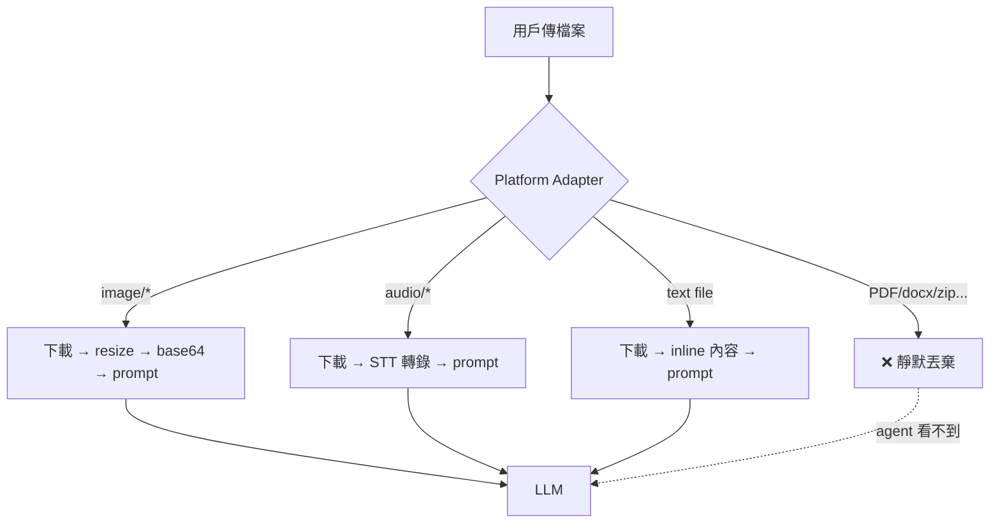
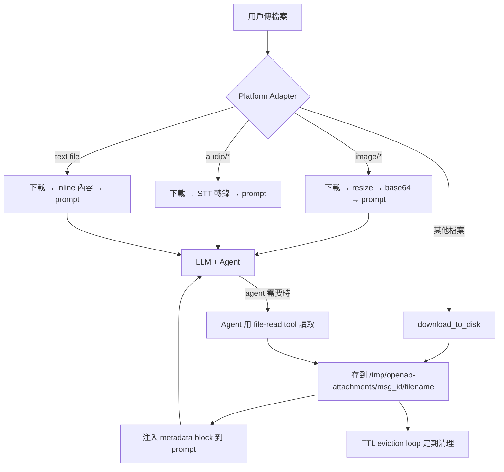
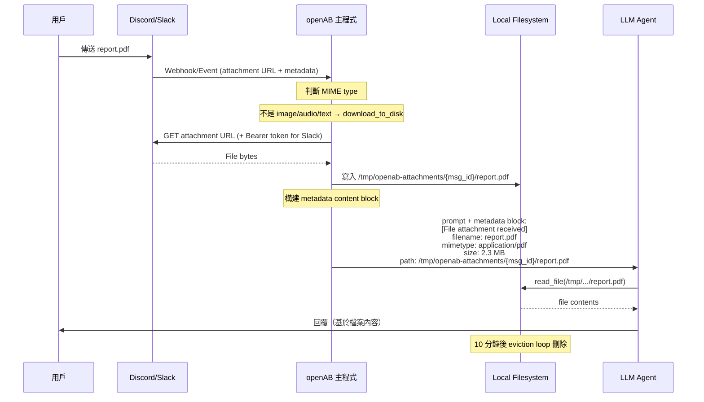
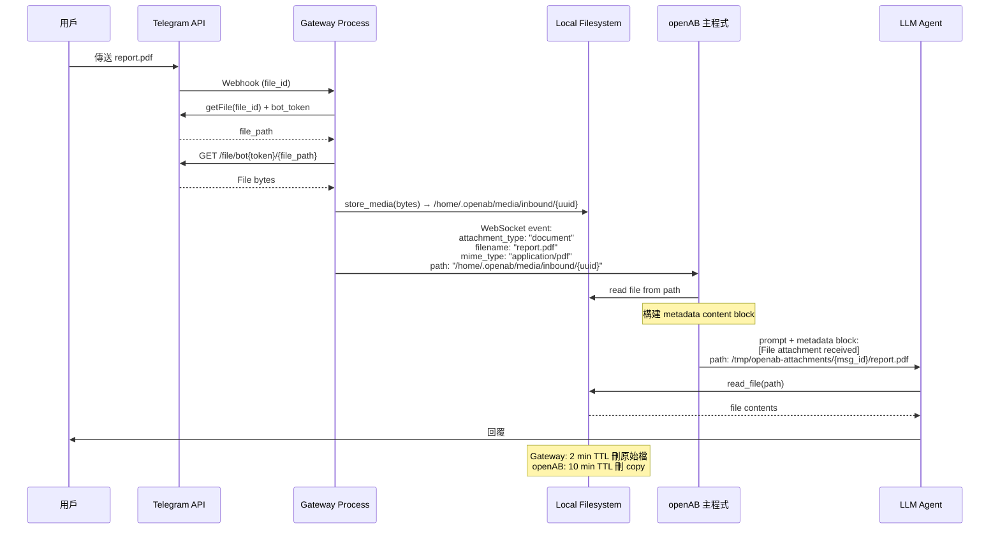
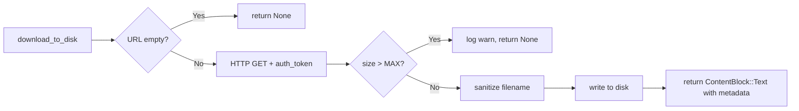
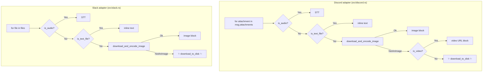
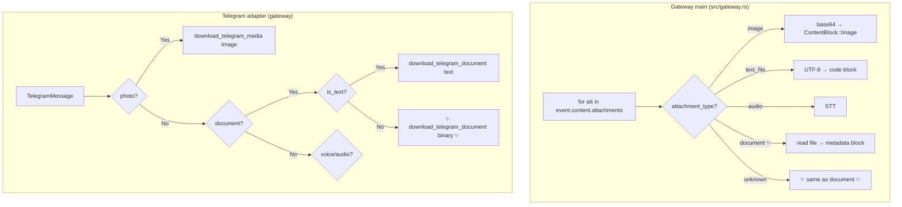
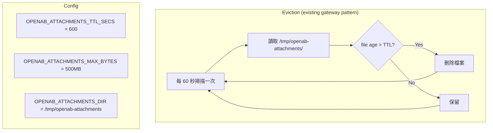

# Design: Inbound File Attachment Support

## Problem

目前 openAB 對非圖片/非音訊/非文字的檔案（PDF、docx、xlsx、video、zip 等）**靜默丟棄**，agent 完全不知道用戶傳了檔案。

## Solution Overview

所有未處理的 inbound 檔案 → download to local disk → 在 prompt 中注入 metadata + 路徑 → agent 用 file-read tool 自行處理 → TTL 過期自動清除。

---

## Architecture Diagrams

### Current State（現狀）



### Proposed State（新設計）



---

## Detailed Flow: Discord / Slack（直連平台）



## Detailed Flow: Gateway 平台（Telegram/飛書/WeChat）



---

## Component Changes

### 1. `src/media.rs` — 新增 `download_to_disk()`



**函數簽名：**
```rust
pub async fn download_to_disk(
    url: &str,
    filename: &str,
    mime_type: &str,
    size: u64,
    bucket_id: &str,
    auth_token: Option<&str>,
) -> Option<ContentBlock>
```

**輸出的 ContentBlock 內容：**
```
<<<EXTERNAL_UNTRUSTED_CONTENT>>>
[File attachment received — not auto-parsed by OpenAB]
- filename: report.pdf
- mimetype: application/pdf
- size: 2.3 MB
- local_path: /tmp/openab-attachments/1234567890/report.pdf

Use your file-reading tools to access this file if needed.
<<<END_EXTERNAL_UNTRUSTED_CONTENT>>>
```

### 2. Adapter 改動



### 3. Gateway 改動



### 4. Cleanup 機制



---

## Security Checklist

| Item | Status |
|------|--------|
| Filename sanitization（path separators, null bytes, `..`） | 必做 |
| Path containment check（resolve 後確認在 target dir 內） | 必做 |
| `<<<EXTERNAL_UNTRUSTED_CONTENT>>>` markers | 必做 |
| Per-file size cap（configurable, default 200MB） | 必做 |
| Total dir size cap（500MB default） | 必做 |
| TTL eviction（10 min default） | 必做 |
| SSRF guard on download URL（block private IP ranges） | 可選（Discord/Slack URL 已知安全）|

---

## Config (config.toml)

```toml
[attachments]
enabled = true
dir = "/tmp/openab-attachments"
max_file_size_mb = 200
max_total_size_mb = 500
ttl_secs = 600
```

---

## Scope

### Phase 1（本次 PR）
- Discord + Slack: download_to_disk for unhandled files
- Gateway: 新增 `document` attachment_type 處理
- Telegram adapter: binary document 支援
- Eviction loop
- Security: filename sanitize + path containment + markers

### Phase 2（後續）
- 飛書/WeChat/Google Chat adapter 同步支援
- PDF text extraction（optional，像 OpenClaw 那樣）
- Config-driven allowlist/blocklist
- Metrics/logging for attachment types
